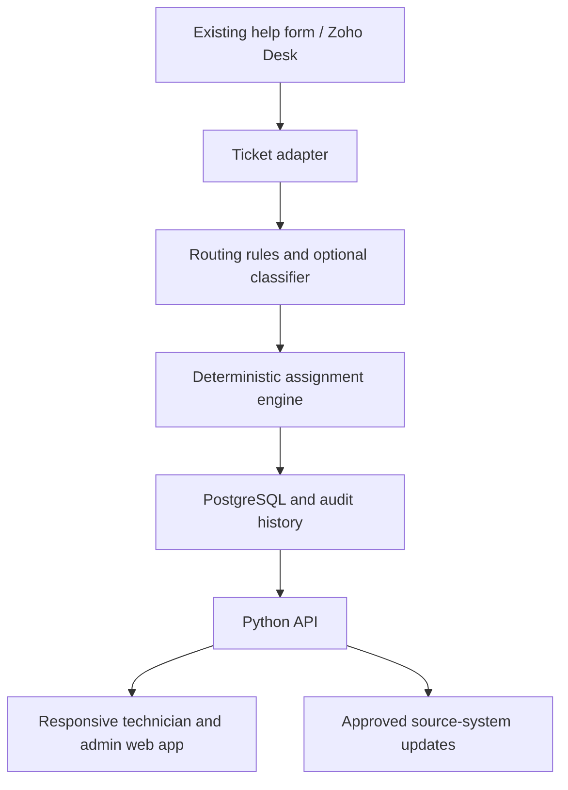

# Roadmap and technical decisions

Dates below are relative to project start and assume one part-time developer. Milestones are gates, not promises.

| Window | Deliverable | Exit gate |
| --- | --- | --- |
| Weeks 1–2 | Interview 2–3 techs and service owners; map actual Zoho/form workflow, roles, categories, data access; collect sanitized examples. | Department confirms scope, owner, data handling and pilot permissions. |
| Weeks 3–4 | Synthetic ticket generator; documented routing rules; pure Python assignment policy and scenario tests. | Demonstrate why every assignment was made and edge cases for crew size, absence and onboarding. |
| Weeks 5–7 | Python API, database schema, authenticated responsive web UI, schedules, status, audit log. | End-to-end demo using synthetic data; security and accessibility review. |
| Weeks 8–9 | Optional Zoho adapter in read-only or shadow mode; sync health and duplicate-event handling. | Source system confirmed and authorized; recommendations compared with actual work without changing live tickets. |
| Weeks 10–12 | Pilot with approved staff and narrowly scoped tickets; dashboard, feedback, rollback procedure. | Department agrees on fairness and routing targets; operations owner accepts documentation. |
| Later | Optional local classifier; approved two-way updates or form replacement. | Quality, latency, privacy and operational costs measured; separate change approval. |

## Proposed architecture

Use a Python backend (FastAPI), PostgreSQL, and a background worker for webhook processing, assignment and notifications. A responsive TypeScript frontend is suitable; React is optional, and a simpler server-rendered client is also viable for a small team. Store UTC instants and campus-local schedule rules, including daylight saving time. Enforce roles in the API, not just the UI. Keep adapters behind interfaces so a mock feed can be replaced without rewriting the scheduler.

## Integration decision

Zoho Desk documents ticket APIs and Ticket_Add/Ticket_Update webhooks. Verify the department's actual product, licensing, privileges, allowed webhook endpoint and whether existing automation would conflict. Prototype with a mock adapter, then read-only polling or webhooks in shadow mode. A webhook handler should acknowledge quickly, enqueue durable processing, fetch authoritative ticket state, deduplicate events, and periodically reconcile missed changes. Two-way updates need explicit field ownership and loop prevention. Do not turn off the existing form while piloting.

## LLM / Ollama decision

First establish a manual/rule-based classification baseline and measure ambiguous tickets. Ollama can run a model locally and expose a localhost API, but running the model locally does not host the website, database, backups, SSO, or monitoring. A continuously available university-managed server still has hardware, electricity, maintenance, patching, security and ownership costs. Keep the model endpoint private and reachable only by the backend; its local API does not require authentication by default. If the department approves, test a small local model on sanitized examples for category suggestions and confidence/abstention, compare accuracy and latency with the baseline, and never let it issue operational commands.

## Data model sketch

- User, RoleGrant, TechnicianProfile (hire date, access, mentorship sign-off)
- WeeklyShift, AvailabilityException, DailyConfirmation
- ServiceCategory, Qualification, CategoryRule, PolicyVersion
- Ticket (external ID, category, estimated effort, priority, state)
- Assignment (team members, planned minutes, timestamps), WorkLog (actual minutes)
- ClassificationSuggestion, DecisionRecord (snapshot and rationale), AuditEvent, IntegrationEvent

## First implementation slice

A command-line simulation with six synthetic technicians, different class schedules, two trainees, a mixed queue (password issue, printer, lab, computer repair), and deterministic, human-readable reasons. This validates the hard scheduling logic before spending time on UI or local AI.

## Sources checked during planning

- Zoho Desk API: https://desk.zoho.com/DeskAPIDocument
- Zoho Desk webhooks: https://desk.zoho.com/support/WebhookDocument.do
- Ollama local API and authentication: https://docs.ollama.com/api/introduction and https://docs.ollama.com/api/authentication
- OWASP LLM prompt-injection guidance: https://genai.owasp.org/llmrisk/llm01-prompt-injection/
